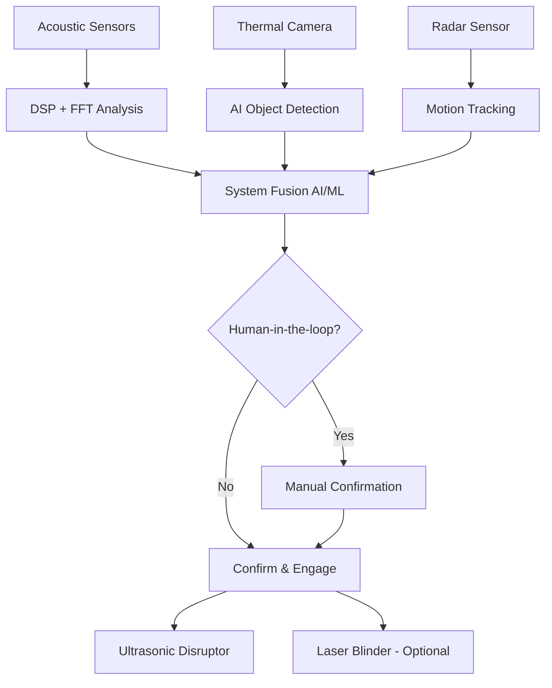
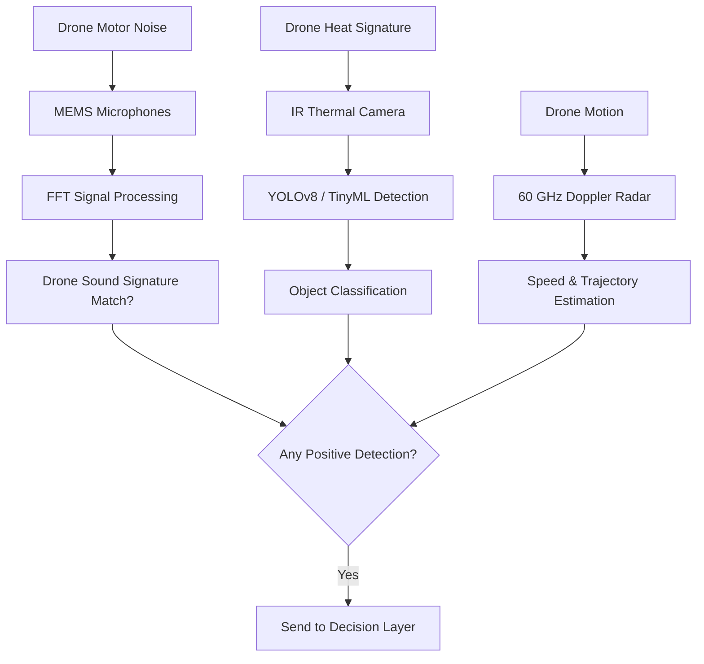
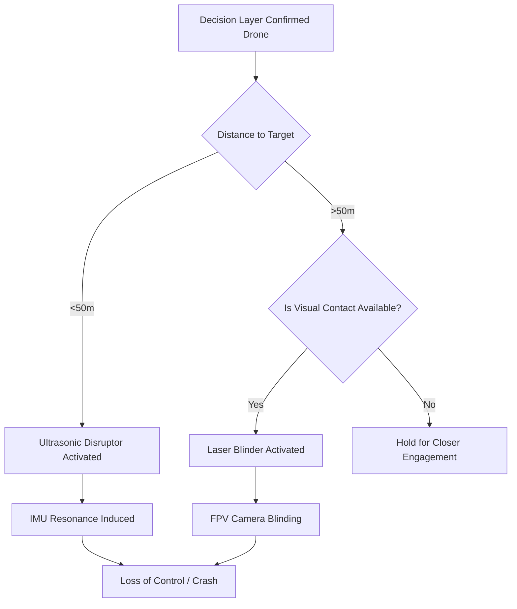

# NATO C-UAS Innovation Proposal – Submission for Rapid Prototyping 


# 📄 **NATO C-UAS Innovation Proposal – Submission for Rapid Prototyping**

## **Solution Title:**
### **Integrated Drone Detection & Disruption System (IDDS)**  
*A Multi-Sensor Countermeasure for Fiber-Optic-Controlled FPV Drones*

---

## **Submitted by:**
[Tom Sapletta / Telemonit, Softreck]  


---

## **Executive Summary**

We propose a **lightweight, modular, and rapidly deployable Counter-Unmanned Aircraft System (C-UAS)** designed to detect and neutralize fiber-optic-controlled FPV drones. The system integrates **acoustic, thermal, and radar sensors** with an **ultrasonic disruption module**, enabling operation in environments where traditional EW-based systems fail.

The solution is:
- **Non-jamming and non-kinetic**, effective against signal-immune drones
- **Fully mobile**, vehicle-mountable, operable on-the-move
- **Open architecture**, compatible with STANAG standards
- **Cost-effective** (< €100K/unit at scale)
- **Autonomous detection-to-response cycle** under 3 seconds

---

## **System Overview**

### **1. Detection Layer**

#### A. **Acoustic Detection Module**
- Uses MEMS microphones and DSP to analyze drone motor signatures
- Detects characteristic harmonics of brushless motors (200 Hz–20 kHz)
- Range: up to 200 meters
- Real-time FFT-based classification of drone sound profiles

#### B. **Thermal Imaging Module**
- MLX90640 or FLIR Lepton IR sensor
- Detects heat signature of batteries and motors
- Works day/night, through smoke/fog
- Range: up to 300 meters

#### C. **Radar Module**
- 60 GHz Doppler radar (e.g., Infineon BGT60LTR11 or TI IWR6843AOP)
- Measures distance, velocity, and trajectory
- Range: up to 10 meters with ±5 cm accuracy
- Complements acoustic and thermal data for 3D tracking

---

### **2. Decision Layer**

- Central AI/ML processor (STM32H7 or similar) evaluates inputs
- Machine learning model trained on drone sound patterns and motion profiles
- Human-in-the-loop confirmation option via GUI or C2 interface
- Decision output triggers the disruption layer

---

### **3. Neutralization Layer**

#### A. **Ultrasonic Disruption Unit (DroneShaker U1)**
- Emits focused ultrasonic waves (20–40 kHz)
- Targets IMU sensors (gyroscopes, accelerometers), inducing resonance
- Causes instability, loss of orientation, and potential crash
- Safe for personnel and infrastructure

#### B. **Optional Visual Disruption (Laser Blinder)**
- Class IV laser (≥5W) aimed at FPV camera
- Temporarily blinds or damages CMOS sensor
- Can be used independently or in tandem with ultrasonics

---

## **System Architecture – Block Diagram**

```
[Acoustic Sensors] → [DSP + FFT Analysis]
     ↓
[Thermal Camera] → [Object Detection AI]
     ↓
[Radar Sensor] → [Motion Tracking]
     ↓
       [AI/ML Decision Engine]
     ↓
   [Human-in-the-loop Confirmation (optional)]
     ↓
   [Disruption Trigger: Ultrasonic + Laser]
```

---

## **Technical Specifications**

| Feature | Specification |
|--------|----------------|
| **Weight** | ≤ 70 kg |
| **Power Consumption** | < 500 W (battery/solar/generator compatible) |
| **Mobility** | Vehicle-mounted, operable on-the-move (40–50 km/h) |
| **Detection Range** | Acoustic: 200 m, Thermal: 300 m, Radar: 10 m |
| **Neutralization Range** | Up to 50 m (ultrasonic), 100 m (laser) |
| **Response Time** | < 3 seconds from detection to engagement |
| **C2 Integration** | STANAG 4586 compliant |
| **Safety Logic** | Arming/disarming switch, human-in-the-loop option |

---

## **Innovation Highlights**

- **No reliance on radio signals** – fully operational against fiber-optic drones
- **Low SWaP** – suitable for frontline deployment
- **Scalable and modular** – can be expanded with additional sensors or effectors
- **Proven physics basis** – uses mechanical resonance and optical interference
- **DIY-compatible core components** – facilitates rapid field production

---

## **Operational Relevance for Ukraine**

- Addresses urgent threat: fiber-optic FPV drones immune to jamming
- Suitable for both static and mobile defense scenarios
- Low cost and complexity enable wide deployment
- Integrates with existing Ukrainian C-UAS and C2 infrastructure

---

## **Development Timeline**

| Phase | Timeline |
|-------|----------|
| Prototype Design & Simulation | July–August 2025 |
| Hardware Assembly & Testing | September 2025 |
| Field Trials (in cooperation with partner units) | October 2025 |
| Delivery of 5 Prototypes | End of October 2025 |

---

## **Estimated Cost per Unit**

| Configuration | Estimated Cost |
|---------------|----------------|
| Base unit (acoustic + thermal + radar + control) | ~€60,000 |
| With ultrasonic disruptor | ~€80,000 |
| With laser blinder | ~€95,000 |
| Scalable to <€70,000/unit at scale (>100 units) | ✅ |


## The architecture and workflow 


### 🧱 1. **System Architecture Diagram**

This diagram shows the high-level structure of the system: detection layer, decision layer, and disruption layer.



---

### 🔍 2. **Detection Workflow Diagram**

This diagram illustrates how the multi-sensor detection works in sequence.



---

### ⚙️ 3. **Disruption Logic Diagram**

This diagram shows how the system decides which countermeasure to activate.




---

## **Conclusion**

This proposal offers a novel, physics-based approach to countering fiber-optic FPV drones. It combines **sensor fusion**, **machine learning classification**, and **non-kinetic neutralization** to deliver a robust, low-cost, and scalable solution tailored for front-line use.

We welcome the opportunity to present this concept during the Pitch Day and proceed with prototyping in support of NATO and Ukrainian forces.
